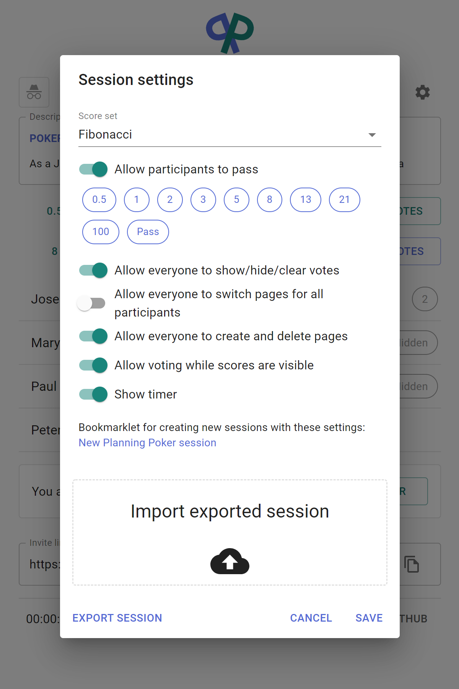

This is a a Planning Poker app, useful for Scrum grooming sessions to avoid anchoring in point estimates.

## [See it live](https://poker.ojdip.net)

## Screenshots

Scores hidden                |  Scores visible              |  Session settings
:---------------------------:|:----------------------------:|:-----------------:
|| 

## Features

- A self contained stateful Node app, no database required
- Ephemeral sessions that are created and cleaned up on demand
- Easily customizable score sets and other session parameters
- Support for multiple pages (e.g. tickets) that can be prepared in advance
- Import/export functionality
- Userscript-friendly browser API
- Median scores are automatically highlighted
- Robust client disconnection handling

## Browser API

Planning Poker exposes an in-browser API that makes it easy to hook your own userscripts, for example to integrate with [your favourite issue tracker](https://medium.com/@jtomaszewski/15-reasons-why-jira-and-confluence-suck-37507361cbdf).

When you are in a live session, Planning Poker injects three objects to `window`, 

 - `window.__PP_SESSION_NAME` - contains the name of the current session
 - `window.__PP_STATE` - contains the current state of the session
 - `window.__PP_DISPATCH` - dispatches a command to the state machine
 
A custom event `ppStateChanged` is also dispatched to `window` every time the state of the state of the board changes, for example:

```
window.addEventListener("ppStateChanged", function(evt) {
    const { previous, current } = evt.detail;
    if (previous.votesVisible !== current.votesVisible) {
        console.log(current.votesVisible 
            ? "Votes are now visible" 
            : "Votes are now hidden"
        );
    }
});
```

### Command reference

```
const dispatch = window.__PP_DISPATCH;

// Set the session parameters
dispatch({ action: "setSettings", settings: {
    // The set of scores
    scoreSet: ["XS","S","M","L","XL","XXL","Pass"],
    // Allows all participants to show/hide/clear votes and control the timer
    allowParticipantControl:true,
    // Allows votes to be cast when the scores are visible
    allowOpenVoting:true,
    // Show the timer
    showTimer:true,
    // Allows participants other than session host to change pages
    allowParticipantPagination:true
}});

// Import the session, based on the exported JSON
dispatch({ action: "importSession", sessionData });

// Create a new page with an optional desription provided
dispatch({ action: "newPage", description });

// Delete current page
dispatch({ action: "deletePage" });

// Navigate to the page with the given index
dispatch({ action: "navigate", pageIndex });

// Set the description on the current page
dispatch({ action: "setDescription", description });

// Set the visibility of votes
dispatch({ action: "setVotesVisible", votesVisible });

// Clear the votes
dispatch({ action: "resetBoard" });

// Cast a vote
dispatch({ action: "vote", score });

// Nudge the client with the given clientId
dispatch({ action: "nudge", clientId });

// Promote the client with given clientId to session host
dispatch({ action: "setHost", clientId });

// Rejoin the user with the given clientId as observer and clear their vote
dispatch({ action: "kick", clientId });

// Clear the vote of a disconnected user with a given display name
dispatch({ action: "kickDisconnected", name });

// Join as participant with the given display name
dispatch({ action: "join", name });

// Rejoin as observer
dispatch({ action: "leave" });

// Start the session timer
dispatch({ action: "startTimer" });

// Pause the session timer
dispatch({ action: "pauseTimer" });

// Reset the session timer
dispatch({ action: "resetTimer" });
```

## Getting Started

First, run the development server:

```bash
yarn dev
```

Open [http://localhost:3000](http://localhost:3000) with your browser to see the result.

## Production build

```bash
yarn build
yarn start
```

See [the example manifest](./kubernetes/manifest.yaml) for deploying Planning Poker to the Kubernetes cluster of your choice.